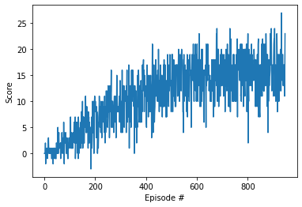

# Report
Author: Frédéric Gouëzec  
Date: 2020-10-13

## Learning Algorithm
The model architecture is a dense neural newtork with one hidden layer fully connected. The size of the hidden layer is 32.

The learning algorithm is a Deep Q-Learning algorithm including the features Experience Replay, Fixed Q-Targets and Double Q-Learning.  
The hyperparameters for the learning algoritm are as follow:  
BUFFER_SIZE = int(1e5)  # replay buffer size  
BATCH_SIZE = 64         # minibatch size  
GAMMA = 0.99            # discount factor  
TAU = 1e-3              # for soft update of target parameters  
LR = 5e-4               # learning rate   
UPDATE_EVERY = 4        # how often to update the network  

## Plot of rewards
Below the plot of rewards per episode illustrates that the agent was able to receive an average reward (over 100 episodes) of at least +13.

The goal for the training phase was to reach a score of +16. This was achieved after 948 episodes.

## Ideas for future work
The top ideas for improvement are implementing:  
1 - a prioritized experience replay buffer.  
2 - a duelling architecture
